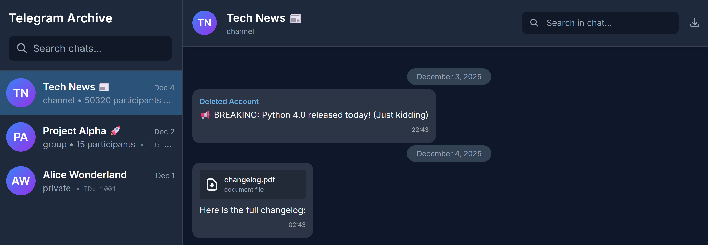
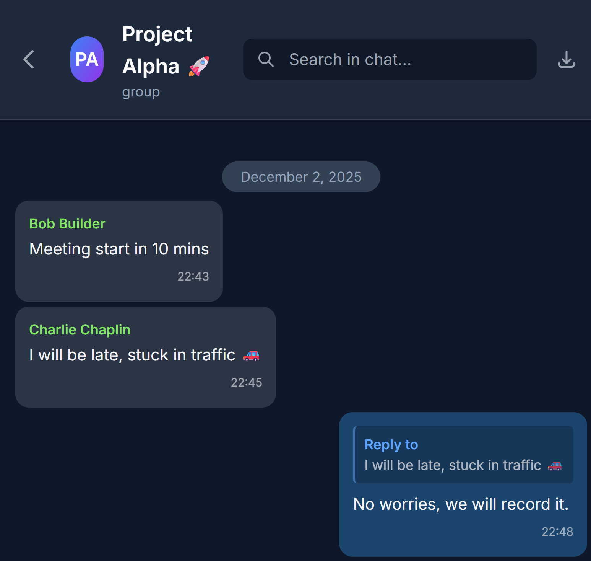

<p align="center">
  
</p>

<h1 align="center">Telegram Archive</h1>

<p align="center">
  <a href="https://hub.docker.com/r/drumsergio/telegram-archive"></a>
  <a href="https://github.com/GeiserX/Telegram-Archive/stargazers"></a>
  <a href="LICENSE"></a>
  <a href="https://github.com/GeiserX/Telegram-Archive/releases"></a>
  <a href="https://codecov.io/gh/GeiserX/Telegram-Archive"></a>
</p>

<p align="center">
  <strong>Automated Telegram backup with Docker. Performs incremental backups of messages and media on a configurable schedule.</strong>
</p>

<p align="center"><em>This project is developed with AI assistance (Claude Code).</em></p>

## Features

### 📦 Backup Engine
- **Incremental backups** — Only downloads new messages since last backup
- **Scheduled execution** — Configurable cron schedule (default: every 6 hours)
- **Real-time listener** — Catch edits, deletions, and new messages instantly between backups
- **Album support** — Groups photos/videos sent together as albums
- **Service messages** — Tracks group photo changes, title changes, user joins/leaves
- **Forwarded message info** — Shows original sender name for forwarded messages
- **Channel signatures** — Displays post author when channels have signatures enabled
- **Media deduplication** — Symlinks identical files to save disk space
- **Avatars always fresh** — Profile photos updated on every backup run

### 🎬 Media Support
- Photos, videos, documents, stickers, GIFs
- Voice messages and audio files with in-browser player
- Polls with vote counts and results
- Configurable size limits and selective download

### 🌐 Web Viewer
- **Telegram-like dark UI** — Feels like the real app
- **Mobile-friendly** — Responsive design with iOS/Android optimizations
- **Integrated lightbox** — View photos and videos without leaving the page
- **Keyboard navigation** — Arrow keys to browse media, Esc to close
- **Real-time updates** — WebSocket sync shows new messages instantly
- **Push notifications** — Get notified even when browser is closed
- **Chat search** — Find messages by text content
- **JSON export** — Download chat history with date range filters

### 🔒 Security & Privacy
- **Multi-user access control** — Master account + DB-backed viewer accounts with per-user chat whitelists
- **Admin panel** — Create, edit, delete viewer accounts with fine-grained chat permissions
- **Audit logging** — Track all login attempts, admin actions, and API access
- **Authenticated media** — Media files require login and respect per-user permissions
- **Mass deletion protection** — Rate limiting prevents accidental data loss
- **Runs as non-root** — Docker best practices

### 🗄️ Database
- **SQLite** (default) — Zero config, single file
- **PostgreSQL** — For larger deployments with real-time LISTEN/NOTIFY

## 🗺️ Roadmap

See **[docs/ROADMAP.md](docs/ROADMAP.md)** for what's planned, and
**[docs/CHANGELOG.md](docs/CHANGELOG.md)** for complete version history.

Have a feature request? [Open an issue](https://github.com/GeiserX/Telegram-Archive/issues)!

## 📸 Screenshots

<details>
<summary>Click to view Desktop and Mobile screenshots</summary>

### Desktop


### Mobile


</details>

## Docker Images

Two separate Docker images are available (v4.0+):

| Image | Purpose | Size |
|-------|---------|------|
| `drumsergio/telegram-archive` | Backup scheduler (requires Telegram credentials) | ~300MB |
| `drumsergio/telegram-archive-viewer` | Web viewer only (no Telegram client) | ~150MB |

> 📦 **Upgrading from v3.x?** See [Upgrading from v3.x to v4.0](#upgrading-from-v3x-to-v40) for migration instructions.

## Quick Start

### 1. Get Telegram API Credentials

1. Go to https://my.telegram.org/apps
2. Log in with your phone number
3. Create a new application (any name/platform)
4. Note your **API ID** (numbers) and **API Hash** (letters+numbers)

### 2. Deploy with Docker

```bash
# Clone the repository
git clone https://github.com/GeiserX/Telegram-Archive
cd Telegram-Archive

# Create data directories
mkdir -p data/session data/backups
chmod -R 755 data/

# Configure environment
cp .env.example .env
```

**Edit `.env`** with your credentials:
```bash
TELEGRAM_API_ID=12345678          # Your API ID
TELEGRAM_API_HASH=abcdef123456    # Your API Hash  
TELEGRAM_PHONE=+1234567890        # Your phone (with country code)
VIEWER_USERNAME=admin             # Required for web access
VIEWER_PASSWORD=change-this       # Required for web access
```

**Optional: enable a SOCKS5 proxy for all Telegram connections** (useful in regions where Telegram is blocked or behind corporate firewalls)
```bash
TELEGRAM_PROXY_TYPE=socks5
TELEGRAM_PROXY_ADDR=127.0.0.1
TELEGRAM_PROXY_PORT=1080
TELEGRAM_PROXY_USERNAME=
TELEGRAM_PROXY_PASSWORD=
TELEGRAM_PROXY_RDNS=false
```

### 3. Authenticate with Telegram

**Option A: Using the provided scripts (recommended for fresh installs)**

```bash
# Run authentication
./init_auth.sh    # Linux/Mac
# init_auth.bat   # Windows
```

**Option B: Direct Docker command (for existing deployments or re-authentication)**

If your session expires or you need to re-authenticate an existing container:

```bash
# Generic command - adjust volume paths and credentials
docker run -it --rm \
  -e TELEGRAM_API_ID=YOUR_API_ID \
  -e TELEGRAM_API_HASH=YOUR_API_HASH \
  -e TELEGRAM_PHONE=+YOUR_PHONE_NUMBER \
  -e SESSION_NAME=telegram_backup \
  -v /path/to/your/session:/data/session \
  drumsergio/telegram-archive:8.5.0 \
  python -m src auth
```

**Example for docker compose deployment:**

```bash
# If using docker compose with a session volume
docker run -it --rm \
  --env-file .env \
  -v ./data:/data \
  drumsergio/telegram-archive:8.5.0 \
  python -m src auth

# Then restart the backup container
docker compose restart telegram-backup
```

**What happens during authentication:**
1. The script connects to Telegram's servers
2. Telegram sends a verification code to your Telegram app (check "Telegram" chat)
3. Enter the code when prompted
4. If you have 2FA enabled, enter your password when prompted
5. Session is saved to the mounted volume for future use

### 4. Start Services

```bash
docker compose up -d
```

**View your backup** at http://localhost:8000

The default compose binds the viewer to `127.0.0.1`. Put it behind a reverse proxy only after setting `VIEWER_USERNAME` and `VIEWER_PASSWORD`. To deliberately run without auth for a local-only viewer, set `ALLOW_ANONYMOUS_VIEWER=true` — this grants read-only access only; writes still require the master account.

### Common Issues

| Problem | Solution |
|---------|----------|
| `Permission denied` | Run `chmod -R 755 data/` |
| `init_auth.sh: command not found` | Run `chmod +x init_auth.sh` first |
| Viewer shows no data | Both containers need same database path - see [Database Configuration](#database-configuration) |
| `Failed to authorize` | Re-run `./init_auth.sh` |

## Web Viewer

The standalone viewer image (`drumsergio/telegram-archive-viewer`) lets you browse backups without running the backup scheduler.

```yaml
# Example: Viewer-only deployment
services:
  telegram-viewer:
    image: drumsergio/telegram-archive-viewer:8.5.0
    ports:
      - "127.0.0.1:8000:8000"
    environment:
      BACKUP_PATH: /data/backups
      DATABASE_DIR: /data/db
      VIEWER_USERNAME: admin
      VIEWER_PASSWORD: your-secure-password
      VIEWER_TIMEZONE: Europe/Madrid
    volumes:
      # SQLite needs write access for WAL files, sessions, audit logs, and thumbnails.
      # Use :ro only when the database is PostgreSQL and media is mounted separately.
      - /path/to/data:/data
```

Browse your backups at **http://localhost:8000**

## Configuration

All settings are configured via environment variables. Set them in your `.env` file or as `environment:` entries in `docker-compose.yml`. See [`.env.example`](.env.example) for a ready-to-use template.

> **`ENABLE_LISTENER` is a master switch.** When set to `false` (the default), all `LISTEN_*` and `MASS_OPERATION_*` variables have no effect. You only need to configure those when you set `ENABLE_LISTENER=true`.

### Environment Variables

The **Scope** column shows whether each variable applies to the backup scheduler (**B**), the web viewer (**V**), or both (**B/V**).

| Variable | Default | Scope | Description |
|----------|---------|:-----:|-------------|
| **Telegram Credentials** | | | |
| `TELEGRAM_API_ID` | *required* | B | API ID from [my.telegram.org](https://my.telegram.org/apps) |
| `TELEGRAM_API_HASH` | *required* | B | API Hash from [my.telegram.org](https://my.telegram.org/apps) |
| `TELEGRAM_PHONE` | *required* | B | Phone number with country code (e.g., `+1234567890`) |
| `TG_ACCOUNT_<N>_API_ID` | - | B | [Multiple accounts](#multiple-accounts): API ID of account `N`. `N` starts at 1 and must be contiguous. Declaring any `TG_ACCOUNT_*` variable switches to indexed mode and the three legacy variables above are ignored |
| `TG_ACCOUNT_<N>_API_HASH` | - | B | API Hash of account `N` |
| `TG_ACCOUNT_<N>_PHONE_NUMBER` | - | B | Phone number of account `N` with country code. Must be distinct across accounts |
| `TG_ACCOUNT_<N>_LABEL` | `default` (N=1), `account<N>` (N≥2) | B | Optional display label for account `N` |
| `TG_ACCOUNT_<N>_SESSION_NAME` | see description | B | Optional session file name for account `N`. Account 1 defaults to the legacy `SESSION_NAME` chain (so an upgraded deployment keeps its session file and never re-logins); accounts 2+ default to `telegram_backup_account<N>` |
| `TELEGRAM_PROXY_TYPE` | - | B | Optional proxy type for all Telegram clients. Currently supports `socks5` |
| `TELEGRAM_PROXY_ADDR` | - | B | SOCKS5 proxy host or IP address |
| `TELEGRAM_PROXY_PORT` | - | B | SOCKS5 proxy port |
| `TELEGRAM_PROXY_USERNAME` | - | B | Optional SOCKS5 username |
| `TELEGRAM_PROXY_PASSWORD` | - | B | Optional SOCKS5 password |
| `TELEGRAM_PROXY_RDNS` | `false` | B | Use remote DNS resolution through the SOCKS5 proxy |
| **Backup Schedule & Storage** | | | |
| `SCHEDULE` | `0 */6 * * *` | B | Cron expression for backup frequency |
| `BACKUP_PATH` | `/data/backups` | B/V | Base path for backup data and media |
| `DOWNLOAD_MEDIA` | `true` | B | Download media files (photos, videos, documents) |
| `MAX_MEDIA_SIZE_MB` | `100` | B | Skip media files larger than this (MB) |
| `MEDIA_MAX_FILENAME_BYTES` | `143` | B | Usable filename byte budget for downloaded media. Raise to `255` on plain ext4/xfs; keep `143` for Synology/eCryptfs encrypted shares |
| `MEDIA_MAX_DOWNLOAD_ATTEMPTS` | `5` | B | Stop retrying a file's download after this many failed attempts. Re-requesting the download resets the counter |
| `MEDIA_FLOOD_SLEEP_THRESHOLD` | `60` | B | Mid-download FloodWaits up to this many seconds are absorbed in place so the transfer resumes instead of restarting from byte 0 (issue #232). `0` restores the old raise-immediately behavior. Absorbed pauses count toward `DOWNLOAD_TIMEOUT_SECONDS` |
| `DIALOG_FLOOD_SLEEP_THRESHOLD` | `60` | B | FloodWaits up to this many seconds during `get_dialogs()`'s internal pagination are absorbed in place so the listing resumes on the same page instead of the whole call restarting from page 1 (issue #295 — an account with enough dialogs to reliably trip a page's FloodWait could otherwise never complete an initial non-whitelist backup, no matter the retry count or schedule spacing). `0` restores the old raise-immediately behavior |
| `DOWNLOAD_TIMEOUT_SECONDS` | `3600` | B | Give up on a single media download after this many seconds. `0` disables the timeout |
| `MEDIA_REFRESH_MAX_ATTEMPTS` | `3` | B | How many times a media item whose file reference expired is re-fetched and retried before it is left for the next scheduled run |
| `MEDIA_REFRESH_TIMEOUT_SECONDS` | `120` | B | Upper bound on one message-refresh round trip, so a wedged connection cannot stall the run |
| `PARALLEL_DOWNLOAD_ENABLED` | `false` | B | Fetch large files over several connections to lift the single-stream speed cap (see below) |
| `PARALLEL_DOWNLOAD_MIN_SIZE_MB` | `20` | B | Only files at least this large use the parallel path (min 1) |
| `PARALLEL_DOWNLOAD_CONNECTIONS` | `4` | B | Concurrent connections per file (clamped 2–8) |
| `PARALLEL_DOWNLOAD_PART_SIZE_KB` | `512` | B | Chunk size per request; one of 4/8/16/32/64/128/256/512 |
| `BATCH_SIZE` | `100` | B | Messages processed per database batch |
| `CHECKPOINT_INTERVAL` | `1` | B | Save backup progress every N batch inserts (lower = safer resume after crash) |
| `DATABASE_TIMEOUT` | `60.0` | B/V | Database operation timeout in seconds |
| `SESSION_NAME` | `telegram_backup` | B | Telethon session file name |
| `SESSION_DIR` | `/data/session` | B | Directory holding the session file. Defaults to a `session/` directory alongside `BACKUP_PATH` |
| `DEDUPLICATE_MEDIA` | `true` | B | Symlink identical media files across chats to save disk space |
| `SYNC_DELETIONS_EDITS` | `false` | B | Batch-check ALL messages for edits/deletions each run (expensive!) |
| `VERIFY_MEDIA` | `false` | B | Re-download missing or corrupted media files |
| `FILL_GAPS` | `false` | B | After each scheduled backup, look for runs of missing message IDs and fetch them |
| `GAP_THRESHOLD` | `50` | B | How many consecutive missing message IDs count as a gap worth filling |
| `STATS_CALCULATION_HOUR` | `3` | B | Hour (0-23) to recalculate backup statistics daily |
| `PRIORITY_CHAT_IDS` | - | B | Comma-separated chat IDs to process first in all operations |
| `SKIP_MEDIA_CHAT_IDS` | - | B | Skip media downloads for specific chats (messages still backed up with text) |
| `SKIP_MEDIA_DELETE_EXISTING` | `true` | B | Delete existing media files and DB records for chats in skip list to reclaim storage |
| `SKIP_TOPIC_IDS` | - | B | Skip specific topics in forum supergroups (format: `chat_id:topic_id,...`) |
| `LOG_LEVEL` | `INFO` | B/V | Logging verbosity: `DEBUG`, `INFO`, `WARNING`/`WARN`, `ERROR` |
| **Flood & Retry Tuning** | | | |
| `MAX_FLOOD_RETRIES` | `5` | B | How many times a Telegram call is retried after a FloodWait before it gives up |
| `MAX_FLOOD_WAIT_SECONDS` | `3600` | B | A FloodWait longer than this is not waited out — the call fails instead |
| `BACKOFF_MIN_SECONDS` | `2.0` | B | First delay of the exponential backoff used for transient connection errors |
| `BACKOFF_MAX_SECONDS` | `300.0` | B | Ceiling for that backoff delay |
| `FLOOD_WAIT_LOG_THRESHOLD` | `10` | B | FloodWaits shorter than this are routine and logged at `DEBUG` instead of `WARNING`. `0` logs every one |
| **Chat Filtering** | | | See [Chat Filtering](#chat-filtering) below |
| `CHAT_IDS` | - | B | **Whitelist mode**: backup ONLY these chats (ignores all other filters) |
| `WHITELIST_RESOLVE_DIALOG_LIMIT` | `1000` | B | When a `CHAT_IDS` entry cannot be resolved (typically a DM on a fresh session), scan up to this many dialogs once to warm the entity cache — it then resolves permanently (issue #234). `0` disables |
| `CHAT_TYPES` | `private,groups,channels` | B | **Type-based mode**: comma-separated chat types to backup |
| `GLOBAL_EXCLUDE_CHAT_IDS` | - | B | Exclude specific chats (any type) |
| `GLOBAL_INCLUDE_CHAT_IDS` | - | B | Force-include specific chats (any type) |
| `EXCLUDE_CHAT_IDS` | - | B | Legacy alias for `GLOBAL_EXCLUDE_CHAT_IDS`, read only when that variable is unset or empty |
| `INCLUDE_CHAT_IDS` | - | B | Legacy alias for `GLOBAL_INCLUDE_CHAT_IDS`, read only when that variable is unset or empty |
| `PRIVATE_EXCLUDE_CHAT_IDS` | - | B | Exclude specific private chats |
| `PRIVATE_INCLUDE_CHAT_IDS` | - | B | Force-include specific private chats |
| `GROUPS_EXCLUDE_CHAT_IDS` | - | B | Exclude specific groups |
| `GROUPS_INCLUDE_CHAT_IDS` | - | B | Force-include specific groups |
| `CHANNELS_EXCLUDE_CHAT_IDS` | - | B | Exclude specific channels |
| `CHANNELS_INCLUDE_CHAT_IDS` | - | B | Force-include specific channels |
| `FOLLOW_CHAT_MIGRATIONS` | `false` | B | Automatically adopt the new supergroup id when a tracked basic group is upgraded to a supergroup, so capture continues without editing include lists. When off, the sweep only warns. See [Group → supergroup migrations](#group--supergroup-migrations) |
| **Real-time Listener** | | | See [Real-time Listener](#real-time-listener) below |
| `ENABLE_LISTENER` | `false` | B | **Master switch** — enables all `LISTEN_*` features below |
| `LISTEN_EDITS` | `true` | B | Apply text edits in real-time |
| `LISTEN_DELETIONS` | `false` | B | Process deletion events from Telegram. Opt-in only |
| `DELETION_MODE` | `hard` | B | When deletions are processed: `hard` removes archived messages (legacy), `soft` keeps messages and marks them deleted |
| `LISTEN_NEW_MESSAGES` | `true` | B | Save new messages in real-time between scheduled backups |
| `LISTEN_NEW_MESSAGES_MEDIA` | `false` | B | Also download media immediately (vs. next scheduled backup) |
| `LISTEN_CHAT_ACTIONS` | `true` | B | Track chat photo, title, and member changes |
| `LISTEN_REACTIONS` | `false` | B | Capture reactions in real-time (opt-in). Best-effort and aggregate-only (per-emoji counts); the scheduled backup reconciles reactions regardless |
| `REACTION_DEBOUNCE_SECONDS` | `1.5` | B | Coalesce a burst of reaction updates on the same message into one write |
| `REACTION_RESWEEP_DAYS` | `0` | B | Re-check the last N days of messages per chat on every scheduled sweep to recover your own reactions (`0` disables). See [Reactions made by your own account](#reactions-made-by-your-own-account) |
| `REACTION_RESWEEP_MAX_PER_CHAT` | `500` | B | Cap on messages re-checked per chat per sweep (≈5 API calls/chat/sweep at the default) |
| `REACTION_RESWEEP_BATCH_DELAY_SECONDS` | `2` | B | Minimum spacing between the re-sweep's API requests, across chats (`0` disables). Smooths bursts; on a FloodWait the re-sweep pauses and resumes within the same run once the wait expires, deferring to the next sweep only if the wait outlives the run or floods repeat |
| `MASS_OPERATION_THRESHOLD` | `10` | B | Max operations per chat before rate limiting triggers |
| `MASS_OPERATION_WINDOW_SECONDS` | `30` | B | Sliding window for counting operations (seconds) |
| `MASS_OPERATION_BUFFER_DELAY` | `2.0` | B | Deprecated compatibility setting; operations are rate-limited, not buffered |
| **Event Webhook** | | | |
| `EVENT_WEBHOOK_ENABLED` | `false` | B | **Master switch** — fire an HTTP request when the listener applies an edit/deletion. Opt-in only. See [Event Webhook](#event-webhook) below |
| `EVENT_WEBHOOK_URL` | — | B | Target URL (`http://` or `https://`). Required when enabled; treated as a secret and never logged |
| `EVENT_WEBHOOK_METHOD` | `POST` | B | `POST` or `PUT` |
| `EVENT_WEBHOOK_HEADERS` | `{}` | B | JSON object of extra headers (auth tokens etc.). Its `Content-Type` drives auto-escaping; defaults to `application/json; charset=utf-8` |
| `EVENT_WEBHOOK_EVENTS` | both | B | Comma list: `message_edited`, `message_deleted` |
| `EVENT_WEBHOOK_CHAT_IDS` | — | B | Comma-separated marked chat ids to fire for; empty = all chats the listener processes |
| `EVENT_WEBHOOK_BODY_TEMPLATE` | JSON body | B | Custom body with `{placeholder}` / `{placeholder\|filter}` substitution; empty = default JSON body |
| **Database** | | | See [Database Configuration](#database-configuration) below |
| `DATABASE_URL` | - | B/V | Full database URL (highest priority, overrides all below) |
| `DB_TYPE` | `sqlite` | B/V | Database engine: `sqlite` or `postgresql` |
| `DB_PATH` | `$BACKUP_PATH/telegram_backup.db` | B/V | Path to SQLite database file |
| `DATABASE_PATH` | - | B/V | Full path to SQLite file (v2 compatible alias for `DB_PATH`) |
| `DATABASE_DIR` | - | B/V | Directory containing `telegram_backup.db` (v2 compatible) |
| `POSTGRES_HOST` | `localhost` | B/V | PostgreSQL host |
| `POSTGRES_PORT` | `5432` | B/V | PostgreSQL port |
| `POSTGRES_USER` | `telegram` | B/V | PostgreSQL username |
| `POSTGRES_PASSWORD` | - | B/V | PostgreSQL password (required when using PostgreSQL) |
| `POSTGRES_DB` | `telegram_backup` | B/V | PostgreSQL database name |
| `DB_ECHO` | `false` | B/V | Log every SQL statement. Debugging only — extremely verbose |
| **Viewer & Authentication** | | | |
| `VIEWER_USERNAME` | - | V | Master web viewer username |
| `VIEWER_PASSWORD` | - | V | Master web viewer password |
| `ALLOW_ANONYMOUS_VIEWER` | `false` | V | Explicitly allow unauthenticated local viewer mode. Grants **read-only** access — browsing/search work, but settings, viewer/token management, and deletions still require the master account |
| `AUTH_SESSION_DAYS` | `30` | V | Days before re-authentication is required |
| `AUTH_PROXY_HEADER` | - | V | Header carrying the authenticated username from a trusted reverse proxy (Authelia, Authentik, Keycloak), e.g. `Remote-User`. See warning below |
| `AUTH_PROXY_ADMIN_USERS` | - | V | Comma-separated usernames from `AUTH_PROXY_HEADER` that get the admin (master) role |
| `AUTH_PROXY_DEFAULT_ACCESS` | `none` | V | Default chat access for auto-created proxy users: `none` or `all` |
| `DISPLAY_CHAT_IDS` | - | V | Restrict viewer to specific chats (comma-separated IDs) |
| `TRUST_PROXY_HEADERS` | `false` | V | Trust `X-Forwarded-For` / `X-Real-IP` only when your reverse proxy overwrites them |
| `INTERNAL_PUSH_SECRET` | - | B/V | Shared secret for SQLite backup-to-viewer realtime push over Docker/private networks |
| `VIEWER_HOST` | `localhost` | B | Viewer host for SQLite realtime push from backup/listener. The `localhost` default only fits a same-host (bare-metal) setup; the shipped compose overrides it to the `telegram-viewer` service |
| `VIEWER_PORT` | `8080` | B | Viewer port for SQLite realtime push from backup/listener. The shipped compose overrides it to `8000`, the viewer container's port |
| `VIEWER_TIMEZONE` | `Europe/Madrid` | V | Timezone for displayed timestamps ([tz database names](https://en.wikipedia.org/wiki/List_of_tz_database_time_zones)) |
| `VIEWER_DEFAULT_THEME` | *(unset — Slate)* | V | Default color theme for browsers with no saved choice: `slate`, `night`, `amoled`, `forest`, `aubergine`, `day`, `paper`. The in-app picker overrides it per browser |
| `SHOW_STATS` | `true` | V | Show backup statistics dropdown in viewer header |
| `THUMBNAIL_CACHE_DIR` | `$BACKUP_PATH/media/.thumbs` | V | Where generated thumbnails are cached. Falls back to `/tmp/telegram-archive-thumbs` when the media directory is not writable |
| **Security** | | | |
| `CORS_ORIGINS` | `*` | V | Allowed CORS origins, comma-separated (e.g., `https://my.domain.com`). Credentials auto-disabled when `*` |
| `SECURE_COOKIES` | `auto` | V | `Secure` flag on auth cookies. Auto-detects from request protocol (`X-Forwarded-Proto` / scheme). Override with `true` or `false` |
| **Notifications** | | | |
| `PUSH_NOTIFICATIONS` | `basic` | V | `off` = disabled, `basic` = in-browser only, `full` = Web Push (works with browser closed) |
| `ENABLE_NOTIFICATIONS` | `false` | V | Older master switch kept for compatibility. Notifications are active when this is `true` **or** `PUSH_NOTIFICATIONS` is `basic`/`full` — prefer `PUSH_NOTIFICATIONS` |
| `VAPID_PRIVATE_KEY` | *auto-generated* | V | Custom VAPID private key for Web Push |
| `VAPID_PUBLIC_KEY` | *auto-generated* | V | Custom VAPID public key for Web Push |
| `VAPID_CONTACT` | `mailto:admin@example.com` | V | Contact email included in Web Push requests |

> ⚠️ **`AUTH_PROXY_HEADER` requires a trusted reverse proxy.** Your proxy MUST strip or overwrite this header on **every** inbound request before it reaches the viewer. If it merely passes the header through, any client can set it themselves and impersonate any user — including an admin — with a single request header. This is a full authentication bypass, not a hardening nicety. Only enable this if you've verified your proxy config strips client-supplied values for the header you choose.

### Multiple Accounts

Since v8.0.0 one deployment can archive several Telegram accounts into the same database and media store. Accounts are declared with indexed variables — `<N>` starts at 1 and must be contiguous:

```bash
TG_ACCOUNT_1_API_ID=11111
TG_ACCOUNT_1_API_HASH=first_account_api_hash
TG_ACCOUNT_1_PHONE_NUMBER=+1234567890
TG_ACCOUNT_1_LABEL=personal

TG_ACCOUNT_2_API_ID=22222
TG_ACCOUNT_2_API_HASH=second_account_api_hash
TG_ACCOUNT_2_PHONE_NUMBER=+0987654321
TG_ACCOUNT_2_LABEL=work
```

How it behaves:

- **No `TG_ACCOUNT_*` variables → nothing changes.** Exactly one account is used, taken from `TELEGRAM_API_ID` / `TELEGRAM_API_HASH` / `TELEGRAM_PHONE` with the same session file as before. Existing deployments upgrade with zero env changes and no re-login.
- **Indexed wins.** When both styles are set, the `TG_ACCOUNT_*` declarations are used and the legacy triple is ignored; startup logs `Multi-account: using N configured account(s)`.
- **Account 1 keeps your existing archive.** On its first login under v8.0.0, the account at index 1 adopts the account row all pre-8.0 data was migrated under. From then on accounts are recognized by their Telegram user id, so re-ordering the indexes later never moves or splits an account's data.
- **Sequential sweeps.** Scheduled backups run account 1 to completion, then account 2, and so on — one Telethon client per account, each with its own session file and its own rate-limit budget.
- **One interactive login per account.** Run the same auth flow as always (`./init_auth.sh`, i.e. `python -m src auth`); it walks every configured account that does not yet have an authorized session. Account 1 reuses the legacy session file; accounts 2+ default to `telegram_backup_account<N>.session`.
- **Filters resolve per account (v8.1.0+).** Every capture filter can be overridden per account with the same indexed pattern: `TG_ACCOUNT_<N>_CHAT_IDS`, `TG_ACCOUNT_<N>_CHAT_TYPES`, `TG_ACCOUNT_<N>_INCLUDE_CHAT_IDS` / `_EXCLUDE_CHAT_IDS` (overriding `GLOBAL_INCLUDE_CHAT_IDS` / `GLOBAL_EXCLUDE_CHAT_IDS`), the `PRIVATE_` / `GROUPS_` / `CHANNELS_` include/exclude variants, `TG_ACCOUNT_<N>_PRIORITY_CHAT_IDS` and `TG_ACCOUNT_<N>_SKIP_MEDIA_CHAT_IDS`. The indexed variable wins for that account and the global one is the fallback, so an account with no overrides behaves exactly as before. An **empty** indexed value inherits the global — Compose's `${VAR:-}` idiom injects empty strings, and silently clearing a whitelist would widen capture — so explicit-empty is spelled with the literal token `none`: `TG_ACCOUNT_2_CHAT_IDS=none` means "no whitelist for account 2, use its type-based filters" even while account 1 keeps its whitelist. Filter-only overrides never switch an install into indexed mode — only the credential variables (`_API_ID` / `_API_HASH` / `_PHONE_NUMBER` / `_LABEL` / `_SESSION_NAME`) do — so a legacy single-account install may set `TG_ACCOUNT_1_CHAT_IDS=none` without declaring indexed credentials. Startup logs each account's effective scope as counts. Settings that are not chat filters stay global: `DOWNLOAD_MEDIA`, `MAX_MEDIA_SIZE_MB`, the listener toggles, and `SKIP_TOPIC_IDS`.

  ```bash
  # Account 1 archives a fixed whitelist; account 2 archives all its groups and channels.
  CHAT_IDS=-1001234567890,-1009876543210
  TG_ACCOUNT_2_CHAT_IDS=none
  TG_ACCOUNT_2_CHAT_TYPES=groups,channels
  ```
- **Loud config errors.** A gap in the numbering, an incomplete account (an ID without its hash), a duplicate phone number, or an unrecognized `TG_ACCOUNT_*` variable stops startup with an error naming the variable.

When configuring through `docker-compose.yml`'s `environment:` block, remember Compose only forwards variables declared there — uncomment the `TG_ACCOUNT_*` lines in the backup service (or switch to `env_file:`) so your `.env` entries reach the container.

### Chat Filtering

There are **two modes** for selecting which chats to backup:

**Mode 1 — Whitelist** (simple): set `CHAT_IDS` to backup **only** those specific chats. All other filtering variables are ignored.

```bash
CHAT_IDS=-1001234567890,-1009876543210    # Only these 2 chats, nothing else
```

**Mode 2 — Type-based** (default): use `CHAT_TYPES` to backup all chats of certain types, then fine-tune with include/exclude lists:

```bash
# Backup all private chats and groups (no channels)
CHAT_TYPES=private,groups

# Backup all channels except one
CHAT_TYPES=channels
CHANNELS_EXCLUDE_CHAT_IDS=-1001234567890

# Backup groups plus one specific channel
CHAT_TYPES=groups,channels
CHANNELS_INCLUDE_CHAT_IDS=-1001234567890
```

> Include variables are **allow-lists**, not additive overrides. `GLOBAL_INCLUDE_CHAT_IDS` limits all selected types to those IDs; type-specific include variables limit only that type. For the simplest exclusive selection, use `CHAT_IDS`.

**Chat ID format** — Telegram uses "marked" IDs:
- **Users**: positive numbers (`123456789`)
- **Basic groups**: negative (`-123456789`)
- **Supergroups/Channels**: negative with `-100` prefix (`-1001234567890`)

Find a chat's ID by forwarding a message to [@userinfobot](https://t.me/userinfobot).

> **DMs in `CHAT_IDS`** — a positive user id only resolves after your session has "seen" that peer (Telegram requires a cached access hash for users; channels don't need one). On a fresh session an unseen DM would otherwise never archive. The backup handles this automatically: when a `CHAT_IDS` entry cannot be resolved, it scans up to `WHITELIST_RESOLVE_DIALOG_LIMIT` dialogs (default 1000, archived folders included) once to warm the cache, after which the id resolves permanently (issue #234). If an id still fails: message the peer once, add them to contacts, or run once without `CHAT_IDS`; for a dormant DM buried deeper than the newest 1000 dialogs, raise `WHITELIST_RESOLVE_DIALOG_LIMIT`.

**Topic filtering** — For forum-enabled supergroups, you can exclude specific topics without excluding the entire chat using `SKIP_TOPIC_IDS`:

```bash
# Skip topics 42 and 1337 in one chat, and topic 7 in another
SKIP_TOPIC_IDS=-1001234567890:42,-1001234567890:1337,-1009876543210:7
```

> Note: Excluding topic `1` (General) works by catching messages with no topic metadata — Telegram omits `reply_to` on General-topic messages, and the archive files exactly those under General. The topic-creating service message (1 per topic) of OTHER topics may still be backed up since it also lacks `reply_to` metadata.

### Real-time Listener

The scheduled backup only captures new messages. To also track edits and deletions between backups, enable the real-time listener:

```yaml
ENABLE_LISTENER: "true"        # Master switch — required
LISTEN_EDITS: "true"           # Track text edits (safe, default: true)
LISTEN_DELETIONS: "false"      # Ignore Telegram deletions entirely
DELETION_MODE: "hard"          # hard=legacy remove, soft=keep and show "deleted"
LISTEN_NEW_MESSAGES: "true"    # Save new messages instantly (default: true)
```

**How it works:** stays connected to Telegram between scheduled backups, captures changes as they happen, and automatically reconnects if disconnected.

**Backup protection:** `LISTEN_DELETIONS=false` is the safe default. Set `LISTEN_DELETIONS=true` only if you want to process deletion events. With the default `DELETION_MODE=hard`, deletions mirror Telegram and remove archived messages. Set `DELETION_MODE=soft` to keep the original archived message and show `deleted` in the message metadata. Soft-deleted messages are retained in the archive — they remain counted in chat statistics and continue to appear in search and exports, flagged as `deleted`.

**Alternative — batch sync:** set `SYNC_DELETIONS_EDITS=true` to check ALL backed-up messages on each scheduled run. This is expensive and slow, and uses the same `DELETION_MODE` behavior for deleted messages.

#### Reactions made by your own account

Telegram does not reliably push reaction updates for the archive account's **own** reactions — the ones you add from another device — to the archive's session. To close that gap, the listener additionally harvests reactions carried on edit events (Telegram delivers some reaction changes as edits), and new messages are checked for reactions the moment they arrive.

For reactions on **older** messages, set `REACTION_RESWEEP_DAYS=N`: on every scheduled sweep the backup re-checks the last N days of messages per chat and reconciles their current reactions. It is bounded by `REACTION_RESWEEP_MAX_PER_CHAT` (default 500, ≈5 API calls per chat per sweep) and defaults to `0` (disabled). Self-reactions on messages older than the sweep's incremental window are captured only by this re-sweep, so enable it if you react to your own older messages and want those counts archived.

Telegram rate-limits `getMessagesReactions` by **burst rate across all chats** (the bucket size varies a lot between accounts — from a handful of requests to dozens), so the re-sweep paces itself: requests are spaced by `REACTION_RESWEEP_BATCH_DELAY_SECONDS` (default `2`, measured across chat boundaries — smoothing, deliberately not sized to make floods impossible). On a FloodWait the re-sweep pauses **without sleeping or retrying** and resumes within the same run once the server-requested window has elapsed; it defers the remainder to the next scheduled sweep only when that window outlives the run, or after repeated floods in one run (a degrading bucket is left alone). Completed chats — and the mid-chat progress of a chat too large for one burst window — are remembered per cycle, so the next scheduled sweep resumes approximately where the last one stopped (the window shifts between runs; the reconcile is idempotent, so overlap is harmless). Over at most a few sweeps every chat in the window gets covered, without ever fighting the rate limiter.

Sizing tip: `REACTION_RESWEEP_MAX_PER_CHAT` decides how much of the flood bucket one chat may consume (each 100 messages ≈ one request). On accounts with a small bucket, a lower cap such as `100` spends ~1 request per chat and lets a single run reach every eligible chat; large caps favor deep per-chat coverage over per-run breadth.

#### FloodWaits during media downloads

The client runs with `flood_sleep_threshold=0` so every rate limit surfaces in the logs instead of pausing silently. For media transfers that visibility used to be self-defeating: a FloodWait in the middle of a download aborted the file, and the retry restarted it from byte 0 — a file larger than one flood-free window could never finish. Media downloads (scheduled sweeps and the live listener alike) therefore absorb short floods in place: pauses up to `MEDIA_FLOOD_SLEEP_THRESHOLD` seconds (default 60) happen inside the transfer, which then resumes at its current offset (issue #232). Longer floods still surface and retry as before, and everything outside media transfers keeps the raise-immediately behavior for full log visibility. Absorbed pauses count toward `DOWNLOAD_TIMEOUT_SECONDS`, so raise both together on flood-heavy accounts; `MEDIA_FLOOD_SLEEP_THRESHOLD=0` restores the old behavior.

#### FloodWaits while fetching the dialog list

The same raise-immediately behavior applied to `get_dialogs()` too, with a worse failure mode than media downloads: Telethon paginates dialogs internally in ~100-per-page chunks, and a FloodWait on any one page aborted the *entire* call rather than just that page. The retry then re-ran `get_dialogs()` from scratch — re-walking every already-successful earlier page before re-tripping the same later page's FloodWait again. For an account with enough dialogs to reliably need that many pages, this never converged: retrying more, or spacing scheduled runs further apart, made no difference, since it wasn't cumulative throttling wearing off but the same deterministic wall being re-hit every attempt (issue #295). Dialog fetches now absorb short per-page floods in place the same way media downloads do: pauses up to `DIALOG_FLOOD_SLEEP_THRESHOLD` seconds (default 60) happen inside `get_dialogs()`, which then resumes pagination instead of restarting it. `DIALOG_FLOOD_SLEEP_THRESHOLD=0` restores the old behavior.

### Event Webhook

Get an HTTP ping the moment the real-time listener archives a message **edit** or **deletion** — point it at [ntfy](https://ntfy.sh), Gotify, Apprise, a Slack/Discord webhook, or anything you run yourself:

```yaml
ENABLE_LISTENER: "true"          # the webhook fires from the listener
LISTEN_DELETIONS: "true"         # required for message_deleted events (off by default!)
EVENT_WEBHOOK_ENABLED: "true"
EVENT_WEBHOOK_URL: "https://ntfy.sh"   # or your own service
# ntfy's JSON endpoint needs a topic in the body — shape it with a template
# (any service that accepts the default JSON body can skip this line):
EVENT_WEBHOOK_BODY_TEMPLATE: '{"topic":"my-archive","title":"{event} in {chat_title}","message":"{text}"}'
```

**How it works:** the webhook fires immediately after the listener commits the change to the archive — near-instant, edit and deletion events only. Deleted text is included in **both** `DELETION_MODE=soft` and `hard` (the content is snapshotted inside the deleting transaction, before it is destroyed).

**Placeholders** available in `EVENT_WEBHOOK_BODY_TEMPLATE`:

| Placeholder | `message_edited` | `message_deleted` |
|---|---|---|
| `{event}` | `message_edited` | `message_deleted` |
| `{chat_id}` / `{message_id}` / `{account_id}` | always present (integers) | always present (integers) |
| `{chat_title}` | archive chat title (private chats: name/username) | same — works even for events Telegram delivers without a peer |
| `{sender_id}` / `{sender_name}` | from the archived row | from the archived row |
| `{date}` | edit time (ISO-8601) | deletion time (ISO-8601) |
| `{text}` | new text | the deleted text |
| `{old_text}` / `{new_text}` | pre-/post-edit text | blank |
| `{media_type}` | e.g. `photo`, `video`; blank if none | same |

**Template rules:** only `{name}` and `{name|filter}` are substituted (letters/digits/underscores); every other brace passes through untouched, so a literal JSON template needs no escaping. Unknown or missing placeholders render blank. Substituted values are inserted in **one pass and never re-expanded** — message text containing `{event}` stays literal. `{{event}}` renders as `{` + value + `}`.

**Filters and auto-escaping:** each placeholder is escaped for the declared `Content-Type` — JSON string escaping for `application/json` (default), percent-encoding for `application/x-www-form-urlencoded`, raw otherwise. Override per placeholder with `{text|jsonescape}`, `{text|urlencode}` or `{text|raw}` (with `raw`, body validity is on you).

**Custom body example** (ntfy JSON publishing):

```yaml
EVENT_WEBHOOK_URL: "https://ntfy.sh"
EVENT_WEBHOOK_BODY_TEMPLATE: '{"topic":"my-archive","title":"{event} in {chat_title}","message":"{text}"}'
```

**Delivery contract:** `POST`/`PUT`, 5-second timeout, up to 3 attempts (transport errors, HTTP 429 and 5xx retry; other statuses are treated as permanent), redirects are **not** followed, and beyond 100 in-flight deliveries new events are dropped (counted in listener stats). There is no persistence or redelivery — the archive itself is the system of record; a failed webhook only loses the ping.

**Two caveats, loudly:** sweep-detected changes (`SYNC_DELETIONS_EDITS`) never fire the webhook — only the real-time listener does. And deletion events require `LISTEN_DELETIONS=true`, which is **off by default**; startup logs a warning for any selected event that can never fire under the current flags. The body carries message content by design — point the URL only at services you control.

### Group → supergroup migrations

When a basic Telegram group is upgraded to a supergroup (adding admins, joining it to a channel, exceeding the member limit, and similar), Telegram gives it a brand-new supergroup id. The old group keeps its history but receives no further messages. Telegram delivers the migration only as a service message that the real-time handlers never see, so without help the archive would silently stop capturing the conversation at the old id.

**Always on — the warning.** Every scheduled backup checks whether any tracked group has migrated to a supergroup that is not in scope and logs a count-only warning, for example: `1 tracked group(s) migrated to a supergroup not in scope; capture stops for them until you add the new id to GROUPS_INCLUDE_CHAT_IDS or enable FOLLOW_CHAT_MIGRATIONS`. The warning repeats every run until you act, and — like all logs in this project — never includes chat ids, titles, or message content. Detection works both live (the migrated group is still visible in the dialog list) and after the fact (a stored migration marker), so migrations that happened while the archiver was offline are still caught.

**Opt-in — follow the migration.** Set `FOLLOW_CHAT_MIGRATIONS=true` and the archiver adopts the new supergroup id automatically: it is remembered across runs and merged into the effective backup scope (so the sweep captures the supergroup even if it is not in your include lists) and into the listener's real-time tracking. The newly adopted supergroup is backed up in the same run it is discovered. Following is additive and idempotent — a supergroup you had already added to `GROUPS_INCLUDE_CHAT_IDS` is unaffected, and one you have explicitly excluded is left alone. When the flag is off nothing is persisted; only the warning fires.

### Mass Operation Protection

When the listener is enabled and `LISTEN_DELETIONS=true`, a sliding-window rate limiter limits mass deletion damage:

1. Operations under the threshold are applied immediately
2. A sliding window tracks operations per chat over `MASS_OPERATION_WINDOW_SECONDS`
3. When `MASS_OPERATION_THRESHOLD` is exceeded, remaining operations are blocked for that window

**Example:** someone deletes 50 messages in 10 seconds with default settings (threshold=10, window=30s) — the first 10 are applied according to `DELETION_MODE`, remaining 40 are blocked. For **zero** deletion handling, set `LISTEN_DELETIONS=false`.

### Parallel Downloads

A single Telegram connection caps download throughput at roughly 10 MB/s. With
`PARALLEL_DOWNLOAD_ENABLED=true`, large files are split into chunks fetched
concurrently over several connections to the file's datacenter and reassembled
on disk, lifting that cap on fast links.

- **Default OFF.** Enable only if download speed is your bottleneck — most setups
  are fine on a single stream.
- **Large files only.** Files below `PARALLEL_DOWNLOAD_MIN_SIZE_MB` (default 20 MB)
  and all photos stay single-stream; chunking overhead isn't worth it for them.
- **Conservative by design.** `PARALLEL_DOWNLOAD_CONNECTIONS` is clamped to 2–8
  (default 4). Telegram throttles hard past ~20 total connections, so keep this low.
  Higher values also raise the cost of a rate limit: a `FloodWait` on any one
  connection cancels its siblings and restarts the whole file under the shared
  retry budget, so under throttling a higher connection count can mean *slower*
  overall throughput. If you see frequent flood waits, lower this back toward 4.
- **FloodWait-aware.** Rate limits flow through the same retry budget as normal
  downloads — no separate backoff scheme.
- **Verified reassembly.** Each chunk is written at its exact offset and the full
  byte range is checked for complete, non-overlapping coverage before the file is
  finalized. Any chunk failure cancels the rest, removes the partial file, and
  falls back transparently to a single stream.
- **Bounded memory.** Peak extra memory ≈ `CONNECTIONS × PART_SIZE_KB`
  (e.g. 4 × 512 KB ≈ 2 MB), since each connection buffers one chunk in flight.

`PARALLEL_DOWNLOAD_PART_SIZE_KB` must be one of 4/8/16/32/64/128/256/512 (a 4 KiB
multiple that divides 1 MiB, per Telegram's `getFile` constraints); invalid values
snap down to the nearest valid size. This feature applies to the **scheduled backup**
path only, not the real-time listener.

### Database Configuration

Telegram Archive supports **SQLite** (default, zero-config) and **PostgreSQL** (better for large deployments with real-time LISTEN/NOTIFY).

> **Viewer shows no data?** Both backup and viewer containers must access the **same database**. Ensure `DB_TYPE` and `DB_PATH` (or `DATABASE_URL`) match in both services.

**SQLite path resolution** (highest priority first): `DATABASE_URL` → `DATABASE_PATH` → `DATABASE_DIR` → `DB_PATH` → `$BACKUP_PATH/telegram_backup.db`

> **Using `DATABASE_URL` for SQLite? Count the slashes.** Four slashes is an absolute
> path; three is a path relative to the container's working directory (`/app`), which
> is not the mounted volume — the archive would be written outside your data directory
> and lost on the next container recreate. Use
> `DATABASE_URL=sqlite:////data/backups/telegram_backup.db`. The `DB_PATH` route does
> not have this trap; it always resolves to an absolute path.

**Using PostgreSQL:**

1. Uncomment the `postgres` service in `docker-compose.yml`
2. Set `DB_TYPE=postgresql` and `POSTGRES_PASSWORD` in your `.env`, or use a full `DATABASE_URL`
3. Uncomment `depends_on` in both backup and viewer services
4. Run `docker compose up -d`

## Updating to Latest Version

### Using Pre-built Images (Recommended)

The shipped `docker-compose.yml` pins an exact release rather than `latest`, so
you always know which version is running and nothing changes underneath you. That
also means `docker compose pull` on its own gets you nothing — it re-pulls the tag
you already have. **Moving the pin is the upgrade.**

```bash
# Take the new compose file, which carries the new pin
git pull

# Then recreate the containers on it
docker compose up -d
```

If you keep your own compose file, edit the two `image:` tags to the release you
want and run `docker compose up -d`:

```yaml
services:
  telegram-backup:
    image: drumsergio/telegram-archive:8.5.0
  telegram-viewer:
    image: drumsergio/telegram-archive-viewer:8.5.0
```

Check [Releases](https://github.com/GeiserX/Telegram-Archive/releases) for available
versions, and [docs/CHANGELOG.md](docs/CHANGELOG.md) for what changed. Only the
newest release gets fixes — see [SECURITY.md](SECURITY.md).

### Building from Source

If you've modified the code or prefer building locally, build under the tag your
compose file already references, so the images you just built are the ones that
start:

```bash
git pull
docker build -t drumsergio/telegram-archive:8.5.0 .
docker build -t drumsergio/telegram-archive-viewer:8.5.0 -f Dockerfile.viewer .
docker compose up -d
```

## ⚠️ Upgrading (Breaking Changes)

> 📦 **Upgrading to 8.0.0?** See **[docs/UPGRADING-8.0.md](docs/UPGRADING-8.0.md)** first — the database is rewritten once, and every viewer URL changes.

For major version upgrades with breaking changes and migration scripts, see **[docs/CHANGELOG.md](docs/CHANGELOG.md)**.

## CLI Commands

### Local Development

#### Option 1: Install with pip (Recommended)

Install the package in editable mode to get the `telegram-archive` command:

```bash
# Install in editable mode
pip install -e .

# Now telegram-archive is available system-wide
telegram-archive --help
telegram-archive --data-dir ./data list-chats
telegram-archive --data-dir ./data stats
telegram-archive --data-dir ./data backup

# Export to JSON
telegram-archive --data-dir ./data export -o backup.json -s 2024-01-01 -e 2024-12-31
```

#### Option 2: Run directly without installation

For development without installing, use the `telegram-archive` executable script:

```bash
# Show all available commands
./telegram-archive --help

# Use custom data directory (instead of /data)
./telegram-archive --data-dir ./data list-chats
./telegram-archive --data-dir ./data stats
./telegram-archive --data-dir ./data backup

# Or symlink to PATH for easier access
sudo ln -s $(pwd)/telegram-archive /usr/local/bin/telegram-archive
telegram-archive --data-dir ./data list-chats
```

### Docker Usage

All commands use the unified `python -m src` interface inside containers:

```bash
# Show all available commands
docker compose exec telegram-backup python -m src --help

# View statistics
docker compose exec telegram-backup python -m src stats

# List chats
docker compose exec telegram-backup python -m src list-chats

# Export to JSON
docker compose exec telegram-backup python -m src export -o backup.json

# Export date range
docker compose exec telegram-backup python -m src export -o backup.json -s 2024-01-01 -e 2024-12-31

# Manual backup run (one-time)
docker compose exec telegram-backup python -m src backup

# Re-authenticate (if session expires)
docker compose exec -it telegram-backup python -m src auth

# Import a Telegram Desktop export (JSON or HTML) into the archive
docker compose exec telegram-backup python -m src import -p /data/export

# Give imported forum messages their topics back (see note below)
docker compose exec telegram-backup python -m src backfill-topics -c -1001234567890

# Detect and fill message gaps left by failed backups
docker compose exec telegram-backup python -m src fill-gaps
```

> **Imported forum chats and topics.** Telegram Desktop exports (HTML *and*
> JSON) carry no forum-topic metadata, so imported forum messages all land in
> the General topic. Once the same account also has API access to the chat,
> `backfill-topics` resets that chat's sync cursor and re-sweeps it text-only
> (media downloads, deletion/edit sync and media verification are disabled
> for the pass) — the sweep's upsert fills in `reply_to_top_id` without
> touching anything else.
>
> **Imported media is adopted, not re-downloaded.** When a normal API backup
> later reaches a message whose file arrived via import, the archive re-keys
> the imported record to the sweep's name and reuses the on-disk file.
>
> **Big exports stream, and an interrupted import resumes.** `result.json` is
> parsed one message at a time (memory stays flat no matter the export size),
> and progress is checkpointed per chat: if an import crashes or is stopped,
> re-running the same command on the same file skips the chats that finished
> and replays the one it was inside — no `--merge` needed, and counters end
> up exactly as if it had never been interrupted. The checkpoint is tied to
> that exact file: if you replace the export (a re-export can contain newer
> messages for already-imported chats), the fresh file starts over and
> overlaps need `--merge` as usual. HTML exports don't resume — they are
> single-chat and small enough not to need it.

## Data Storage

```
data/
├── session/
│   └── telegram_backup.session
└── backups/
    ├── telegram_backup.db
    └── media/
        └── {chat_id}/
            └── {files}
```

## Troubleshooting

| Problem | Solution |
|---------|----------|
| "Failed to authorize" | Run `./init_auth.sh` again |
| "Permission denied" | `chmod -R 755 data/` |
| Media files missing/corrupted | Set `VERIFY_MEDIA=true` to re-download them |
| Backup interrupted | Set `VERIFY_MEDIA=true` once to recover missing files |
| Re-run touches every media file in a git-annex / DataLad backup | See [git-annex / DataLad layouts](#git-annex--datalad-layouts) below |
| "duplicate key value violates unique constraint reactions_pkey" | See [Reactions Sequence Fix](#reactions-sequence-fix-postgresql) below |

### git-annex / DataLad layouts

When the media tree is committed to git-annex (or DataLad), files appear
as symlinks pointing into the repository's annex object store. The
backup process treats an existing symlink as authoritative and never
overwrites it on re-run -- but content-hash deduplication only
recognizes existing `_shared/` blobs when their symlink targets are
reachable from the running process. If you mount only the working tree
into a container, the annex object store sits outside the mount and is
invisible to the backup.

For fully idempotent re-runs against an annex-managed archive, ensure
the annex object store is reachable -- typically by mounting the
repository root (not just the per-session subdirectory) and pointing
the data path at the session subdirectory inside it.

### Reactions Sequence Fix (PostgreSQL)

If you see this error during backup:
```
duplicate key value violates unique constraint "reactions_pkey"
DETAIL: Key (id)=(XXXX) already exists
```

**Cause:** The PostgreSQL sequence for `reactions.id` got out of sync with the actual data. This commonly occurs after database restores or migrations.

**Solutions:**

1. **Upgrade to v4.1.2+** (recommended) - The code automatically detects and recovers from this issue.

2. **Manual fix** - Run this SQL command:
   ```bash
   docker exec -i <postgres-container> psql -U telegram -d telegram_backup -c \
     "SELECT setval('reactions_id_seq', COALESCE((SELECT MAX(id) FROM reactions), 0) + 1, false);"
   ```

   Or use the provided script:
   ```bash
   curl -O https://raw.githubusercontent.com/GeiserX/Telegram-Archive/main/scripts/fix_reactions_sequence.sql
   docker exec -i <postgres-container> psql -U telegram -d telegram_backup < fix_reactions_sequence.sql
   ```

## Limitations

- Secret chats not supported (API limitation)
- Edit history not tracked (only latest version stored; enable `ENABLE_LISTENER=true` to track edits in real-time)
- Deleted messages before first backup cannot be recovered

## Ecosystem

| Project | Type | Description |
|---------|------|-------------|
| [telegram-archive-mcp](https://github.com/GeiserX/telegram-archive-mcp) | MCP Server | Query archived messages from AI assistants |
| [n8n-nodes-telegram-archive](https://github.com/GeiserX/n8n-nodes-telegram-archive) | n8n Node | Workflow automation for Telegram Archive |

## Other Telegram Projects by GeiserX

- [paperless-telegram-bot](https://github.com/GeiserX/paperless-telegram-bot) — Manage Paperless-NGX documents through Telegram
- [AskePub](https://github.com/GeiserX/AskePub) — Telegram bot for ePub annotation with GPT-4
- [telegram-delay-channel-cloner](https://github.com/GeiserX/telegram-delay-channel-cloner) — Relay messages between channels with configurable delay
- [jellyfin-telegram-channel-sync](https://github.com/GeiserX/jellyfin-telegram-channel-sync) — Sync Jellyfin access with Telegram channel membership
- [telegram-slskd-local-bot](https://github.com/GeiserX/telegram-slskd-local-bot) — Automated music discovery and download via Telegram

## Supporters

> This project is made possible by generous supporters:
> **Calvin**

## License

GPL-3.0. See [LICENSE](LICENSE) for details.

Built with [Telethon](https://github.com/LonamiWebs/Telethon).
