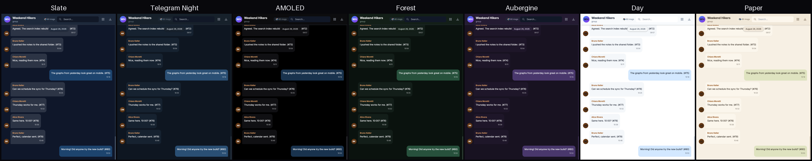
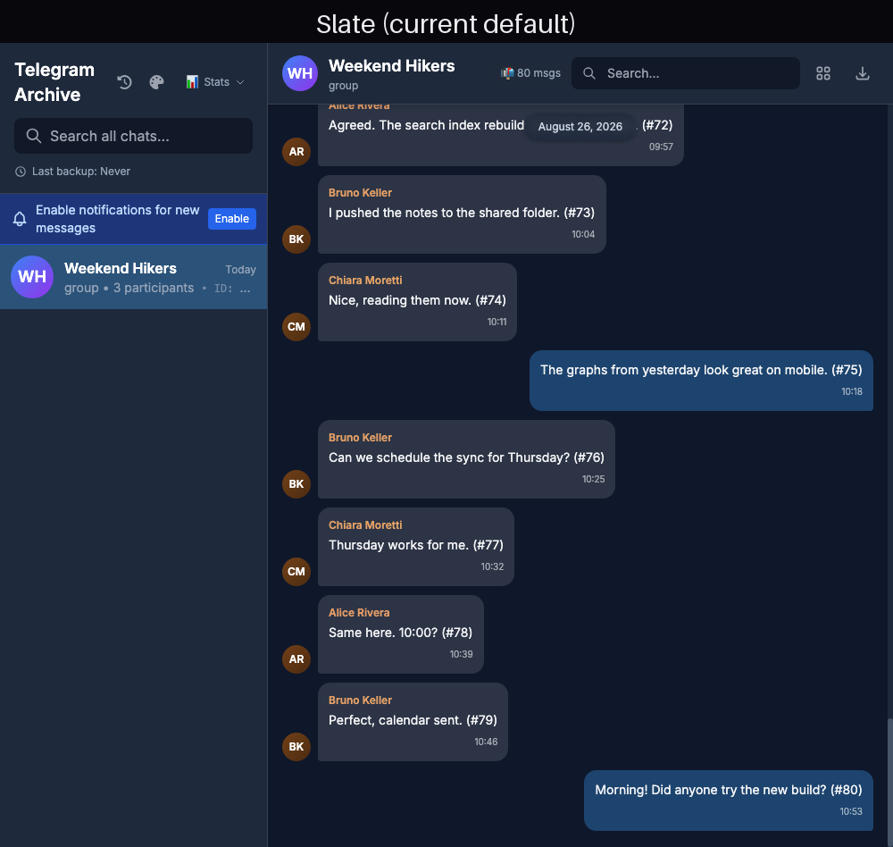
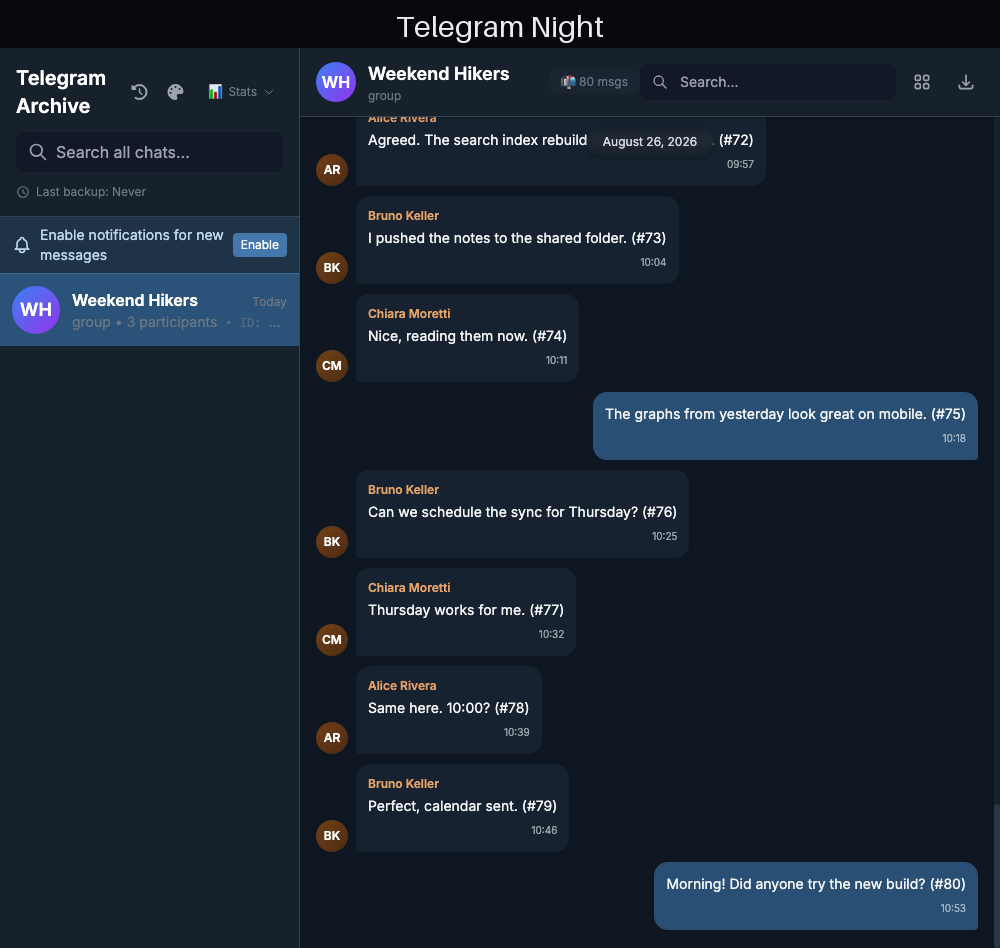
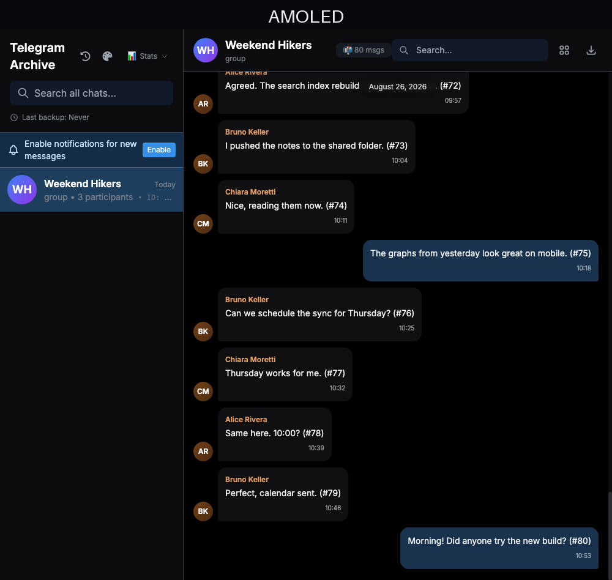
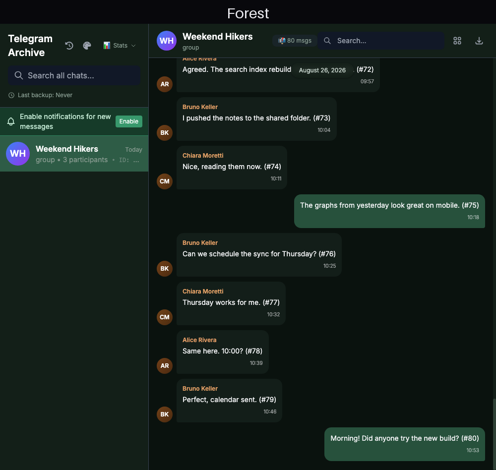
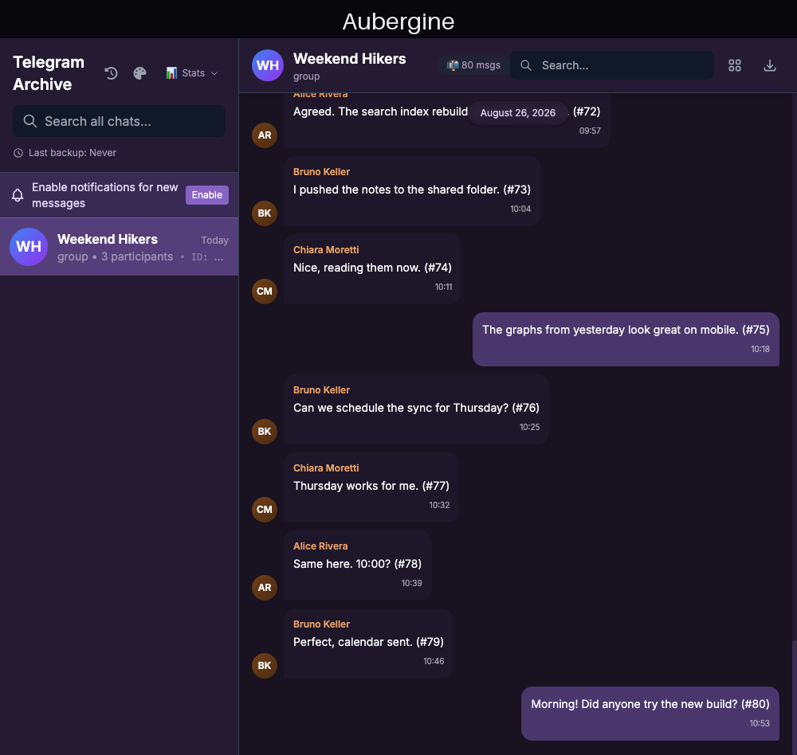
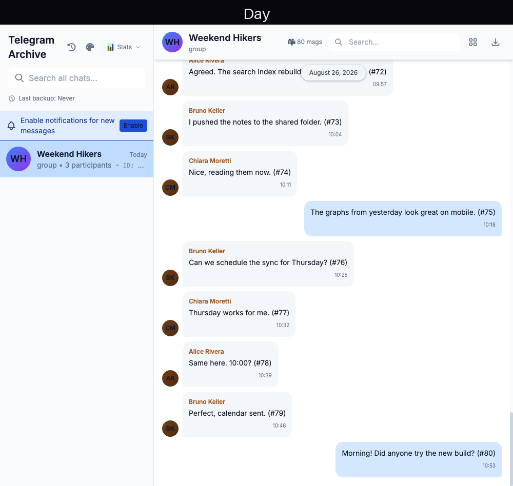
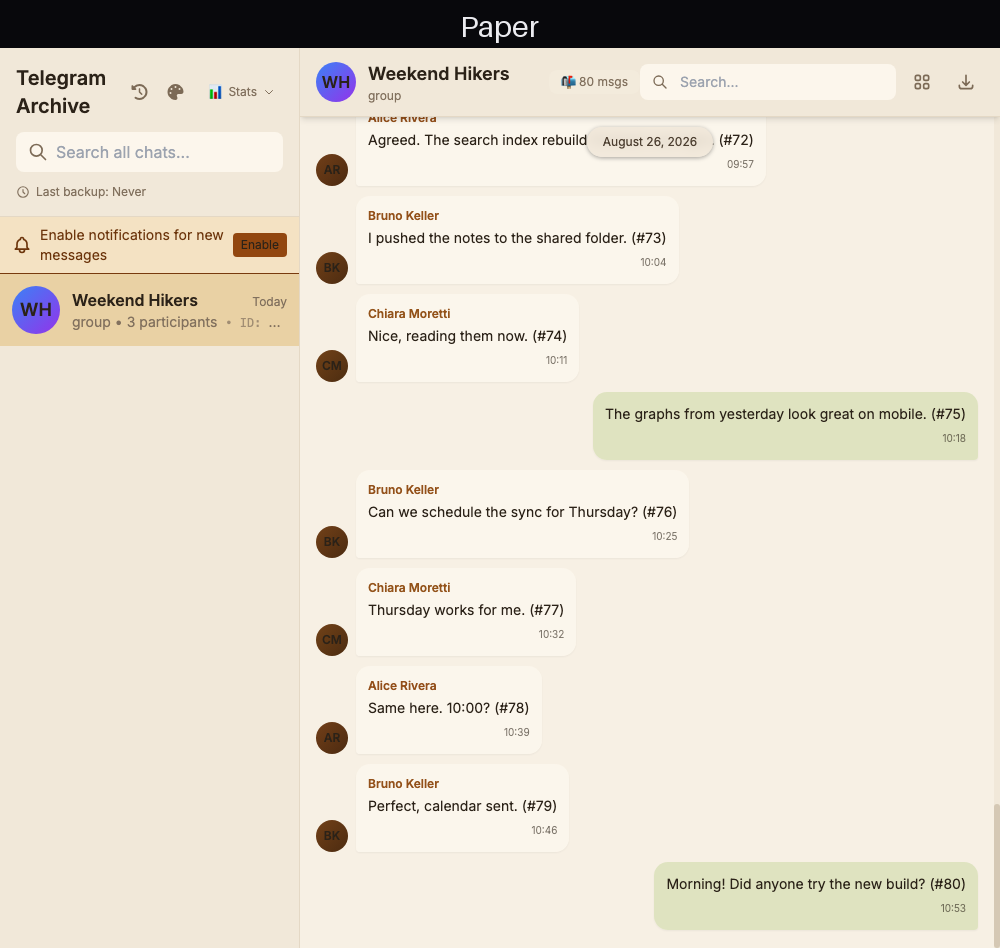
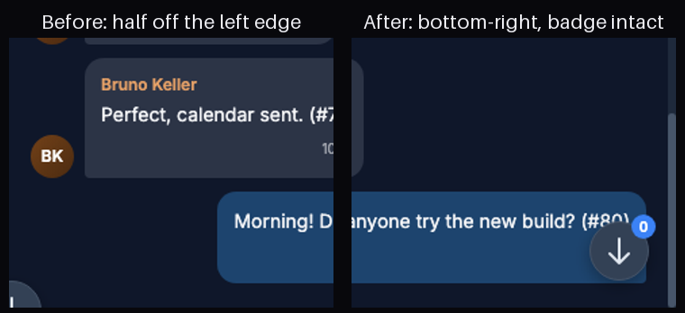

# Viewer color themes

The viewer has always shipped one palette: the dark slate it launched with. This doc covers the
theme system that replaces it — how it works, the palettes it ships, what stays fixed, what was
verified, and the decisions still open.

## What ships

A palette picker in the sidebar header (the palette icon next to the changes-feed clock). Seven
palettes — five dark, two light — applied instantly, remembered per browser:

| Theme | Canvas | Sidebar | Own bubble | Accent | Character |
|---|---|---|---|---|---|
| **Slate** (default) | `#0f172a` | `#1e293b` | `#1d4772` | `#3b82f6` | What the viewer has always looked like |
| **Telegram Night** | `#0e1621` | `#17212b` | `#2b5278` | `#5288c1` | Telegram Desktop's dark palette |
| **AMOLED** | `#000000` | `#0c0c0e` | `#1a3652` | `#4ea4f5` | True black for OLED screens |
| **Forest** | `#0a120e` | `#131f18` | `#28543e` | `#4caf82` | Deep greens, easy on the eyes |
| **Aubergine** | `#181221` | `#241a33` | `#4c3970` | `#9b7bd4` | Purple night, a nod to the classic mobile theme |
| **Day** | `#ffffff` | `#f8fafc` | `#d1e7ff` | `#2563eb` | Clean white light mode |
| **Paper** | `#f7f0e4` | `#f1e8d9` | `#dde3be` | `#ad5815` | Warm off-white with an amber accent — reading-room light |

### Full-page screenshots

| | |
|---|---|
|  |  |
|  |  |
|  |  |
|  | |

The choice persists in `localStorage` (per browser, works for anonymous viewers too — no backend).
`?theme=night` in the URL applies and saves a theme, then scrubs itself from the address bar like
the other one-shot parameters — that makes themes linkable and testable.

A deployment can pick its own default with `VIEWER_DEFAULT_THEME` (e.g. `night`): browsers with no
saved choice get that palette from the very first paint (the value is substituted into the page at
serve time, not fetched), and a user's picker choice always wins over it. Precedence:
`?theme=` → saved choice → `VIEWER_DEFAULT_THEME` → Slate.

## How it works

Every color the app's chrome uses is a CSS variable holding an RGB triplet — 18 tokens
(`--tg-bg`, `--tg-sidebar`, `--tg-own`, `--tg-accent`, …) defined on `:root`. A theme is one CSS
block that restates all 18 under `:root[data-theme="night"]`. Three consumers read them:

1. **Tailwind classes.** The `tg` color family in the Tailwind config now resolves through
   `rgb(var(--tg-…) / <alpha-value>)`, so `bg-tg-sidebar/80` keeps compositing opacity correctly.
   The ~95 hardcoded blue utilities (`bg-blue-600`, `text-blue-400`, `focus:ring-blue-400`, …)
   were swept onto accent tokens, so the accent follows the theme.
2. **The stylesheet.** All 15 palette hex literals in the CSS (scrollbars, the scroll-to-latest
   button, date pills, the audio playbar, spinners) now read the variables.
3. **JavaScript.** Message bubble backgrounds were computed HSLA strings; they now emit
   `rgb(var(--tg-own) / 0.95)` and `rgb(var(--tg-other) / 0.80)`, with the default tokens set to
   the exact RGB equivalents of the old HSLA values.

A three-line script at the top of `<head>` applies the saved theme before the first paint, so
there is no flash of the default palette on load.

## What deliberately stays fixed

- **The login page.** It renders before any user preference can load; it keeps its blue identity.
- **Avatar fallback gradients.** They encode identity (per-chat initials circles), not chrome.
- **Semantic colors.** Green forward markers, red errors, amber warnings — meaning, not decoration.
- **Black scrims and media overlays.** The lightbox backdrop, in-bubble reply washes and the
  video play button darken whatever they sit on; that works on every palette, light included.

## Verification

- **The default is pixel-identical.** Same seeded archive, same viewport, screenshots before and
  after the change: 333 of 900,000 pixels differ, all inside two 16×16 icon boxes in the sidebar
  header — the new palette button and the Stats chip it nudged over. Bubbles, text, scrollbars,
  spacing: byte-for-byte the same.
- **Each palette was measured, not eyeballed.** Dominant-color sampling of canvas, sidebar, both
  bubble types and accent controls per theme matches the token definitions exactly.
- Full test suite green (3772 passed); the template-structure gate and the frontend string tests
  cover the new markup.

## The mobile jump-button fix (separate PR)

The button that appears when you scroll up was showing as a cut-off sliver on phones. Two stacked
causes, fixed independently of the themes:

1. Its markup carried Tailwind's `relative` utility, which tied the stylesheet's
   `position: absolute` on specificity and won on order — turning `right: 20px` into "shift 20px
   left of static position" and parking the button half off the bottom-left edge. Measured in a
   live browser: `x: -20` before, `x: 436` (bottom-right, 20px margins) after. The utility came in
   with the unseen-count badge, which needs a positioned parent — `position: absolute` already is
   one, so it is simply dropped.
2. ~~The app sized itself to `100vh`…~~ **Reverted in 8.4.1.** The same change also switched the
   layout root to `100dvh`, on the theory that `100vh` hides bottom-anchored content behind iOS
   Safari's retractable toolbar. That half was reasoning, not measurement — it cannot be
   reproduced in headless Chrome, which has no retractable toolbar — and on a real iPhone it did
   the opposite of what was intended: the app rendered short, leaving a large dead band under the
   message list. `body` also carries the safe-area padding and `overflow: hidden`, and in that
   combination the dynamic unit resolves to less than the visible area. The layout root is back on
   `h-screen`, and a test now fails if a dvh override is re-added.

The clipped button was fully explained by cause 1 on its own. Both the fix and the revert carry
regression tests, each watched go red against the code it guards against.

## Open decisions

1. ~~**Default palette.**~~ Solved: `VIEWER_DEFAULT_THEME` sets the deployment's default; Slate
   when unset.
2. ~~**Light theme.**~~ Solved: the ~315 neutral utilities (grays, whites, washes) now ride an
   `ink` + `n100–n950` token scale — the dark palettes inherit the exact old gray values from
   `:root` (all five verified pixel-identical after the sweep), and Day/Paper override the scale.
   Sender-name lightness also rides the theme (`--tg-name-l`), so names stay readable on light
   canvases. Avatars, black scrims and the login page stay as they were.
3. **Server-side persistence.** The choice could ride the viewer account instead of the browser,
   so it follows a user across devices. Needs a column and two endpoints; localStorage covers the
   common case today.
4. **PWA manifest color.** The installed-app splash/status color is a static manifest value and
   does not follow the theme. Cosmetic, low priority.

## Trying it

On the test instance once the `:dev` images rebuild, or any deployment of this branch:
open the viewer and use the palette icon, or append `?theme=night`, `?theme=amoled`,
`?theme=forest`, `?theme=aubergine`, `?theme=day`, `?theme=paper` — and `?theme=slate` to go
back. `VIEWER_DEFAULT_THEME` accepts the same ids.
